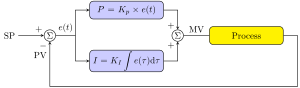
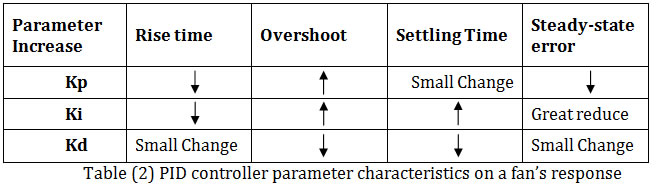

# PID control
PID Controllers, are in control systems lingo, a closed loop control system. The objective of [control systems](https://en.wikipedia.org/wiki/Control_system) are 
to vary the output and/or the behavior of a system, according to our needs. This could be vaying the termerature using an air conditioner to a particular temperature, 
to moving an aircraft in a certain way, or moving the joint on a robotic arm to a certain position. As you can imagine, control systems are used everywhere in engineering,
and are really important in robotics.

## What are closed loop controllers?
  Closed loop controllers take feedback from the output of the system. They use the error of the actual output from the required output, to control whatever we want to control. This is in contrast to open loop controllers that give inputs to the system that does not depend on the actual output of that system. Open loop controllers do not have any idea of the actual output, so often they act in a pre-programmed way, and cannot respond to dynamic situations. This makes the more complicated closed loop controllers more preferred, unless its difficult to obtain feedback, since it requires additional sensors

## What are PID controllers?
To understand PID controllers, lets first look at **Proportional** control.

Imagine you had to control the temperature of a water heater, and reach some temperature value. We control the voltage to a heating element to control the temperature.

A sensible and obvious approach would be to use a scaled version of the difference between observed(from some sensor) and desired temperature. This will work because when the water is cold, we need to give high voltage to give it enough heat. But as it heats up, we can reduce the voltage, till it becomes closer and closer to the required value. This is an easy way to do things, but it has some issues : One is that proportional controllers take a lot of time to reach their desired value. Theoretically, they take infinite time! Another is that any form of resistance or damping in the system will lead to an equilibrium situation, where the controller input balances the damping term, and the system will be in steady state. Thats not really great!

An improvement is to add an **integral** term. What this does is kind of give an offset to the contribution of the proportional term. This eliminates the damping problem because the integral of that error will build up, till the error reduces to zero. What the integral term does is let us . But one problem that it has is it introduces **overshoot**. Due to the integral term, there is a chance that the controller output is not zero even when the system output becomes same as desired value. This means the system output continues to increase till the negative error will cause it to come back down. If not tuned correctly, this can cause some oscillations. In our example, we can think of the controller heating the water too much, and the temperature goes above the required value. One very usefull analogy is to think of the integral term as the controller remembering the **past history** of the error.

Now we have seen **P**roportional, and **I**ntegral terms and how they can be used to make a controller. Now, what could we add next to improve out controller? We have seen that the integral term helps the controller remember its past, now what if we give it the ability to predict the future?! It might be able to forsee and overshoot condition and slow itself down. Now what value in calculus now helps us to predict where a function is going? Of course, its the **D**erivative! This is where the **PID** controller gets its name - **P**roportional, **I**ntegral, **D**erivative. The derivative term improves the speed of the system and its response to varying control inputs. However, it can cause oscillations if not tuned properly! Now, since we understand very simply how a PID controller works, and why we have these three terms, lets look at how to tune one for our application!

## Tuning PID Controllers
Tuning is the process of selecting the best values for the gains of the integral, derivative, and proportional terms of the PID controller. This is a very important process in creating a controller, and there are several ways to do this.

### Manual methods
We can always tweak the gains by a trial and error method, and check if our results are good enough. this requires a good understanding of how each term affects our particular model

### Using step response
This is simular to the first method in that we have to vary the parameters ourselves, but finding how a system responds to a step input (abruptly giving the controller a new target) will give a good idea of how to improve the system. 

The following table can give a good idea of how to change the parameters to improve performance.

